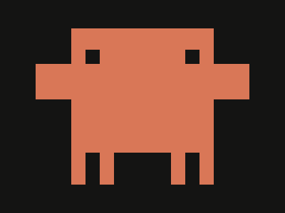

# Daily Target — Oct 2, 2026

Challenge: <https://cssbattle.dev/play/KX0Y2zNqhT7RlOsL0IRq>

## Result

<table>
	<tr>
		<th width="50%">User Submission</th>
		<th width="50%">Target</th>
	</tr>
	<tr>
		<td width="50%" align="center">
			
		</td>
		<td width="50%" align="center">
			
		</td>
	</tr>
</table>

## Code

```html
<p><style>&{margin:40 100;border-inline:60px double#D97757;background:#141413;*{background:#D97757;margin:0-40 45;color:D97757;*{height:50;box-shadow:-70px -35px 0-5vh#141413,70px -35px 0-5vh#141413,-125px 0,125px 0;margin:32 55
```
