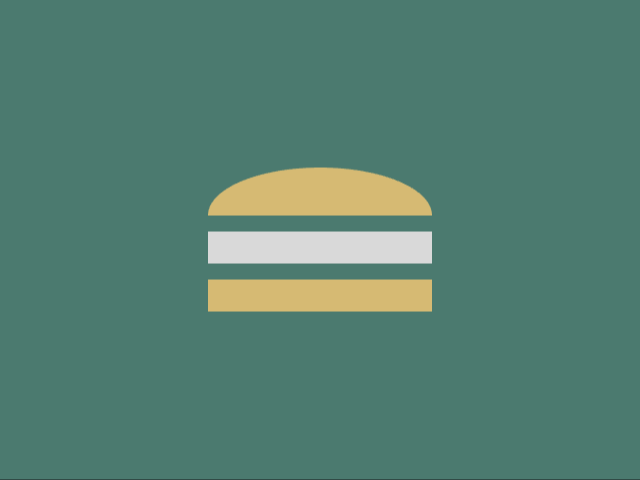

# Daily Target — Oct 4, 2026

Challenge: <https://cssbattle.dev/play/J10ALm0Yug1xXEdXhAHp>

## Result

<table>
	<tr>
		<th width="50%">User Submission</th>
		<th width="50%">Target</th>
	</tr>
	<tr>
		<td width="50%" align="center">
			
		</td>
		<td width="50%" align="center">
			
		</td>
	</tr>
</table>

## Code

```html
<style>&{color:4C7A6F;outline:9in solid;margin:105 130;background:#D6BA72;border-radius:50%50%0 0/33%;*{border:11q solid;margin:30-10 20;background:#D9D9D9
```
