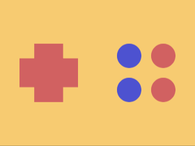

# Daily Target — Oct 5, 2026

Challenge: <https://cssbattle.dev/play/kKeIFq1dBXUmV9k1c7d0>

## Result

<table>
	<tr>
		<th width="50%">User Submission</th>
		<th width="50%">Target</th>
	</tr>
	<tr>
		<td width="50%" align="center">
			
		</td>
		<td width="50%" align="center">
			
		</td>
	</tr>
</table>

## Code

```html
<style>
& {
  corner-shape: notch;
}
* {
  color: D16161;
  box-shadow: var(--a, inset 0 9in);
  margin: 90 60% 90 40;
  border-radius: 32Q;
  * {
    background: #f7cb71;
    margin: 35;
    --a: 55vh -35px #4d52d0, 55vh 35px #4d52d0, 235px -35px, 235px 35px;
  }
}
</style>
```
